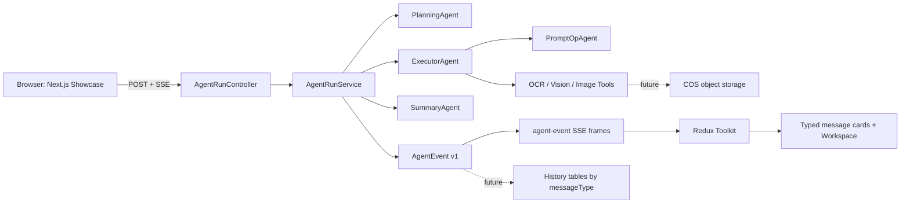

# Jenda Agent Development Guide

This document is the continuation point for this secondary-development project. Read it before making changes.

## 1. Project Status

The repository is forked from JoyAgent-JDGenie and all new work is made on:

```text
feature/agent-ui-demo
```

Implemented so far:

- A standalone Next.js agent workspace showcase in `showcase/`.
- Redux Toolkit state for agent mode, stream events and workspace assets.
- Ant Design X conversations and sender UI.
- A versioned backend SSE event contract.
- `POST /api/v1/agent/sessions/{sessionId}/runs` SSE endpoint.
- A replaceable `DemoAgentRunService` that emits the complete event sequence.

Not implemented yet:

- Real PlanningAgent, ExecutorAgent and SummaryAgent adapters.
- Frontend consumption of the new backend SSE endpoint.
- MySQL history persistence, JWT, COS upload, model API and image tool integrations.

## 2. Repository Map

```text
JendaAgent/
├── genie-backend/                 Spring Boot 3 backend from JoyAgent-JDGenie
│   └── src/main/java/com/jd/genie/
│       ├── controller/AgentRunController.java
│       ├── model/agent/           New stable SSE protocol
│       └── service/agent/         Agent run lifecycle and adapters
├── ui/                            Upstream Vite UI. Do not refactor it for the showcase.
├── showcase/                      New Next.js + Redux + Ant Design X demo
│   ├── app/page.tsx               Workspace UI and current simulated stream
│   └── store.ts                   Frontend mode, messages and assets state
└── README_JENDA_AGENT.md          This development guide
```

`agent-ui-demo/` is an abandoned intermediate scaffold created before a Windows sandbox issue. Do not use it for new work. The active frontend is `showcase/`.

## 3. Target Architecture



## 4. SSE Protocol

### Endpoint

```http
POST /api/v1/agent/sessions/{sessionId}/runs
Content-Type: application/json
Accept: text/event-stream
```

### Request

```json
{
  "prompt": "根据参考图生成产品视觉海报",
  "mode": "plan-solve",
  "imageUrls": ["https://cos.example.com/uploads/reference.png"]
}
```

`mode` values:

- `plan-solve`
- `react`

### SSE Frame

Every application frame uses `event: agent-event` and has this envelope:

```json
{
  "schemaVersion": "v1",
  "eventId": "uuid",
  "sessionId": "session-001",
  "runId": "uuid",
  "sequence": 3,
  "messageType": "tool_result",
  "status": "complete",
  "agent": "ImageToolchain",
  "occurredAt": "2026-07-18T12:00:00Z",
  "payload": {
    "title": "工具并发执行：视觉理解 + 图像生成",
    "content": "视觉约束提取完成，生成任务已进入质量校验。"
  }
}
```

Message types are deliberately stable because they will become history routing keys:

```text
run_started | plan | task | tool_result | image | summary |
run_completed | heartbeat | error
```

Status values:

```text
queued | running | complete | failed
```

## 5. Current Backend Design

`AgentRunController` is independent from the upstream `GenieController`. Do not change `/AutoAgent` to support the new UI.

`DemoAgentRunService` currently exists for frontend-backend SSE integration. It emits this sequence:

```text
run_started
-> plan
-> task
-> tool_result
-> image
-> summary
-> run_completed
```

Replace only the event production in `DemoAgentRunService` when real agents are introduced. Keep `AgentEvent` and the controller route stable.

## 6. Local Development

### Frontend

```powershell
cd F:\JendaAgent\JendaAgent\showcase
corepack pnpm dev
```

Open `http://localhost:3000`.

pnpm 11 may block the optional Next.js `sharp` build script. If it does:

```powershell
corepack pnpm approve-builds
```

Select `sharp`, confirm, then run `corepack pnpm dev` again.

### Backend compile

The system Maven cache is not writable in this environment. Use the project cache:

```powershell
cd F:\JendaAgent\JendaAgent\genie-backend
mvn "-Dmaven.repo.local=F:\JendaAgent\.m2" -DskipTests compile
```

This command passed after the current SSE implementation was added.

### Port notes

- The upstream application config uses port `8080`.
- Do not assume `8080` or `8081` are free. Docker Desktop currently occupies `8081`.
- Use an unused port for a local backend instance, for example `18080`.

## 7. Next Implementation Order

1. Replace `showcase/app/page.tsx` simulated `delay()` sequence with `@microsoft/fetch-event-source` consumption of `agent-event`.
2. Map each backend `messageType` to the frontend message card and Workspace asset reducer.
3. Introduce interfaces and real implementations for `PlanningAgent`, `ExecutorAgent`, and `SummaryAgent`.
4. Add MySQL tables: `agent_session`, `agent_message`, `agent_plan_message`, `agent_task_message`, `agent_tool_result_message`, `agent_image_message`.
5. Persist each event before sending it and add session replay APIs.
6. Add COS upload and turn uploaded files into validated `image_url` values.
7. Connect Qwen, OCR, image generation/editing and PromptOpAgent.
8. Add JWT, SMS login, Redis state and production deployment configuration.

## 8. Known Issues And Decisions

- `showcase/` has a complete visual demo but currently uses simulated events. This is intentional until SSE consumption is implemented.
- `DemoAgentRunService` uses an `example.invalid` image URL. It is a placeholder until the COS adapter exists.
- The backend was compiled successfully. Runtime endpoint verification was not completed because `8080` is an old service and `8081` belongs to Docker Desktop.
- The original upstream `ui/` is Vite. The new `showcase/` is intentionally separate so the upstream frontend remains runnable.

## 9. Documentation Rule

For every future functional change, update this file in the same change set:

- Mark the completed item in the status or implementation order.
- Add or revise API and event contract changes.
- Record new environment variables, ports, migrations and external services.
- Add blockers and the exact next action if validation cannot finish.

