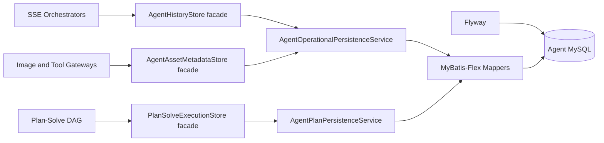

# Step 58: Agent Data Layer Engineering

## Goal

The agent operational data layer is now separated from the upstream JDGenie demo data source. New agent state is managed by Flyway and accessed through MyBatis-Flex entities, mappers, and services.

## Runtime Architecture



The upstream DataAgent H2 database remains independent. Agent persistence uses `agent.history.jdbc-url`, `agent.history.username`, and `agent.history.password`.
`AgentPersistenceMapperRegistry` keeps the agent-only MyBatis `SqlSessionTemplate` internal. This is deliberate: exposing a second global `SqlSessionFactory` or `SqlSessionTemplate` causes Spring Boot to skip the upstream MyBatis-Plus configuration.

## Authoritative Tables

| Table | Purpose | Trace keys |
| --- | --- | --- |
| `agent_session` | User-owned conversation state | `session_id`, `owner_user_id` |
| `agent_run` | A single Plan-Solve or ReAct execution | `run_id`, `session_id`, `owner_user_id` |
| `agent_event` | Append-only SSE/domain event ledger | `event_id`, `run_id`, `sequence_no` |
| `agent_tool_call` | Normalized tool input/result lineage | `tool_call_id`, `call_event_id`, `result_event_id` |
| `agent_asset` | COS upload/generated image metadata | `asset_id`, `session_id`, `run_id`, `owner_user_id` |
| `agent_plan_execution` | Structured Plan-Solve DAG snapshot | `run_id`, `session_id` |
| `agent_plan_task_state` | DAG task attempt/result state | `run_id`, `task_id` |
| `agent_plan_approval` | Human confirmation audit record | `approval_id`, `run_id`, `task_id` |

`agent_message` is retained only for replaying pre-Flyway history. New events are written to `agent_event`.

## Migration Rules

- Migrations live in `genie-backend/src/main/resources/db/migration/agent`.
- Flyway creates `flyway_schema_history` in the agent persistence database.
- `baselineOnMigrate=true`, baseline version `0`, allows an existing development database containing pre-Flyway tables to adopt migration V1 without deleting data.
- Never edit an applied migration. Add `V2__...sql`, `V3__...sql`, and so on.
- Before a destructive schema change, create an additive migration, backfill in a separate step, deploy readers, then remove legacy fields in a later release.

## Local Verification

```powershell
cd F:\JendaAgent\JendaAgent
docker compose --parallel 1 --env-file .\deploy\.env -f .\deploy\docker-compose.yml up --build -d
docker compose --env-file .\deploy\.env -f .\deploy\docker-compose.yml logs --tail 120 backend
```

The backend is healthy only when the log contains `Started GenieApplication` and contains no later `Application run failed` entry. Check container stability after startup:

```powershell
docker compose --env-file .\deploy\.env -f .\deploy\docker-compose.yml ps
```

After startup, inspect the migration ledger:

```powershell
docker compose --env-file .\deploy\.env -f .\deploy\docker-compose.yml exec -T mysql sh -lc `
  'mysql -u"$MYSQL_USER" -p"$MYSQL_PASSWORD" "$MYSQL_DATABASE" -e "SELECT installed_rank, version, description, success FROM flyway_schema_history ORDER BY installed_rank;"'
```

## Operational Notes

- `agent_event` is the durable audit stream used by session replay.
- `agent_tool_call` joins request and result events without exposing model keys or COS private credentials.
- `agent_asset` connects COS metadata to the owning user, session, and optionally a run.
- Transactional writes use `agentPersistenceTransactionManager`.

## Follow-up Improvements

1. Add Testcontainers integration tests for blank MySQL and legacy-schema baseline paths.
2. Add database foreign keys after a production backfill and data-quality check.
3. Partition/archive `agent_event` for long-lived tenants.
4. Add a read-model table for workspace timeline queries if event volume grows.